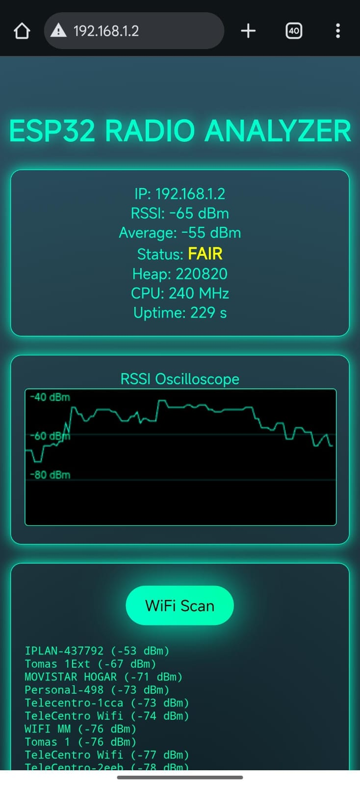

# ESP32 Cyber Panel 📡

A futuristic, cyber-aesthetic styling ESP32 Web Server project for analyzing WiFi signals.

## Features ✨

- **Real-time Stats**: Monitor IP address, RSSI (Signal Strength), Heap memory, CPU frequency, and Uptime.
- **RSSI Oscilloscope**: Visual graph of signal strength over time.
- **WiFi Scanner**: Scan for nearby networks and view their signal quality.
- **Cyber Aesthetics**: Dark mode interface with neon cyan accents, gradients, and glassmorphism cards.

## Hardware 🛠️

- ESP32 Development Board (e.g., ESP32-WROOM-32)

## Setup ⚙️

1. **Credentials**: Open `esp32_cyber_panel.ino` and update the following lines with your WiFi credentials:
    ```cpp
    const char* ssid = "YOUR_WIFI_SSID";
    const char* password = "YOUR_WIFI_PASSWORD";
    ```
2. **Flash**: Upload the code to your ESP32 using the Arduino IDE.
3. **Connect**: Open the Serial Monitor (115200 baud) to see the assigned IP address.
4. **Access**: Enter the IP address in your web browser to view the Cyber Panel.

## Usage 🕹️

- **Dashboard**: View live metrics.
- **Oscilloscope**: Watch the graph update every ~120ms to see signal stability.
- **Scan**: Click "WiFi Scan" to list available networks and their signal strength (dBm).

## Screenshots 📸


